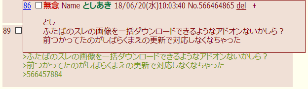
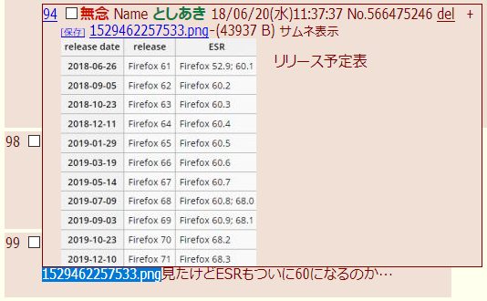
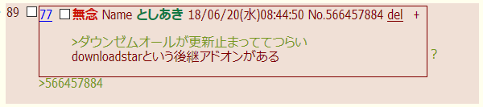
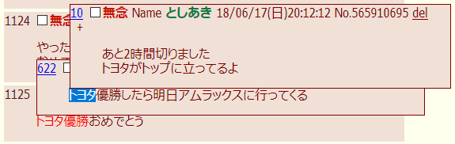

##  KOSHIAN 引用をポップアップで表示 改
このFirefoxアドオンはふたば☆ちゃんねるで引用元をポップアップ表示する[Pachira](https://addons.mozilla.org/ja/firefox/user/anonymous-a0bba9187b568f98732d22d51c5955a6/)氏の[KOSHIAN 引用をポップアップで表示](https://addons.mozilla.org/ja/firefox/addon/koshian-popup-quote/)の非公式改変版です。  
レス内の選択文字列の引用元をポップアップ表示する機能などを追加しました。  

※このアドオンはWebExtensionアドオン対応のFirefox専用となります。  
※他のKOSHIAN改変版などのふたば支援ツール一覧は[こちら](https://github.com/akoya-tomo/futaba_auto_reloader_K/wiki/)。  

## 機能
* オリジナルの機能（KOSHIAN 引用をポップアップで表示）  
  - レス送信モードで引用元をポップアップで表示  
      
  - スレ内のレスに通しのレス番号をつけて表示  
* 追加された機能（KOSHIAN 引用をポップアップで表示 改）  
  - レス内の選択文字列の引用元をポップアップ表示  
    レス内の選択文字列にマウスオーバーすると、選択文字列の引用元をポップアップ表示します。  
      
    引用符の無い画像ファイル名やレスNo.の引用元を確認したいときなどに便利です。  
  - 数字だけの文字列をレスNo.やファイル名として検索  
    「No.」や拡張子の無い数字だけの文字列をレスNo.やファイル名として引用元をポップアップ表示します。  
      
    選択文字列ポップアップでも使用できます。  
  - ポップアップしたレスのレス番号をクリックでそのレスに移動  
    引用ポップアップしたレスの左上にあるレス番号をクリックすると、そのレスに移動することができます。  
  - 「現在のレスに近いレスをポップアップ」オプションを追加（デフォルト：無効）  
    引用元の候補の中で現在のレスに一番近いレスを引用ポップアップします。  
  - 「行単位で一致するレスを優先してポップアップ」オプションを追加（デフォルト：有効）  
    行単位で完全に一致する引用元のレスを優先して引用ポップアップします。  
  - 「レスへの返信を探す」オプションを追加（デフォルト：有効）  
    レスに対して返信しているレスの番号をレスの右上に表示します。返信レス番号にマウスオーバーすると返信レスがポップアップします。  
      
  - 「ポップアップの文字サイズ」オプションを追加（デフォルト：0 = 標準の文字サイズ）  
    ポップアップの文字サイズを変更することができます。  

## インストール
**GitHub**  
  

※「接続エラーのため、アドオンをダウンロードできませんでした。」と表示されてインストール出来ない時はリンクを右クリックしてxpiファイルをダウンロードし、メニューのツール→アドオン（またはCtrl+Shift+A）で表示されたアドオンマネージャーのページにxpiファイルをドラッグ＆ドロップして下さい。  

## 設定
機能の設定はアドオンのオプション画面から変更できます。  

* x文字以上の選択した文字列の引用を探す（デフォルト：0 = 無効）  
  - レス内の選択した文字列が設定した文字数以上の時に引用元を探してポップアップします。  
    0で機能が無効になります。  
    短い選択文字列にマウスオーバーしてポップアップするのが煩わしいときは大きめの数字を設定してください。  

## 追加機能の補足  
* ポップアップ内でも文字列選択して更に引用ポップアップが可能です。  
  最後に文字列選択したポップアップより下にあるポップアップの選択文字列は赤い文字で表示され、赤い文字列と同じポップアップ内をクリックでリセットできます。  
    
* 文字列選択で引用ポップアップするのはレス内の本文のみです。  
  題名・Name・ID・IP・No.やファイル名を文字列選択してもポップアップしません。  
* 複数行に跨る文字列選択ではポップアップしません。  
* 返信ポップアップ上からは更なるポップアップはしません。  

## 注意事項  
* 本アドオンを有効にしたときはオリジナル版を無効にするか削除して下さい。  
* オリジナル版とは別アドオンなので設定は初期値に戻ります。  
  再度設定をお願い致します。  
* 設定の変更やアドオンの更新をしたときは表示中のページを更新することで反映されます。  
* KOSHIAN 自動リンク生成のv1.2以前と組み合わせては使えません。  
  [KOSHIAN 自動リンク生成](https://addons.mozilla.org/ja/firefox/addon/koshian-autolink-futaba/) v1.3以上または[KOSHIAN 自動リンク生成 改](https://github.com/akoya-tomo/koshian_autolink_futaba_kai/)と組み合わせてご使用ください。  

## 既知の問題  
* 選択文字列にKOSHIAN 自動リンク生成（改）が生成したリンクが含まれていると、文字列選択ポップアップは動作しません。  
* 赤い文字列の部分から文字列選択を開始すると選択範囲が変化することがある。  
  赤い文字列の部分から選択開始したいときは先に赤い文字列をリセットして下さい。  
* 引用内の文字列を選択してポップアップするとポップアップが重なって表示されることがある。  
  引用文字列と選択文字列のポップアップが異なると発生することがあります。  
  選択文字列のポップアップが前面に表示されます。  

## 更新履歴  
* v1.8.0 2019-05-09
  - ふたばのリロードの仕様変更に対応  
* v1.7.2 2019-04-13
  - 「レスへの返信を探す」機能で引用が複数行あるときの引用元レスの探索精度を改善
* v1.7.1 2018-12-20
  - 改行だけの引用があると引用ポップアップや返信ポップアップが正常に表示されない不具合を修正
* v1.7.0 2018-09-22  
  - レスへの返信を探すオプションを追加  
  - ポップアップのフォントサイズを変更するオプションを追加
  - ポップアップ左上のレス番号クリックで移動したときに移動先のレスの背景色を一定時間変更するように修正  
* v1.6.1 2018-09-07  
  - ポップアップ内の引用元が無い引用テキストの上で右クリックしたときにポップアップが閉じる不具合を修正  
* v1.6.0 2018-06-28  
  - 「現在のレスに近いレスをポップアップ」オプションを追加  
  - 「行単位で一致するレスを優先してポップアップ」オプションを追加  
  - 引用ポップアップ内で他のKOSHIANのボタンが動作するように修正  
    （但しボタンを動作させるには該当するKOSHIANの修正も必要）  
* v1.5.2 2018-06-22  
  - v1.3.0以降で引用ポップアップ内での選択文字列ポップアップが機能しない不具合修正  
* v1.5.1 2018-06-21  
  - [KOSHIAN 画像保存ボタン](https://github.com/akoya-tomo/koshian_image_save_button)で保存ボタンを表示するとスレ画像ファイル名が引用ポップアップしない不具合修正  
* v1.5.0 2018-06-12  
  - [KOSHIAN 引用メニュー 改](https://github.com/akoya-tomo/koshian_quote_futaba_kai)の「No.をクリックで引用する」オプションに対応  
* v1.4.1 2018-05-07  
  - オリジナルの引用元の検索を厳格化  
* v1.4.0 2018-04-20  
  - コンテキストメニューにマウスオーバーしたときにポップアップが閉じないように修正  
  - 引用の上で右ボタンを押下したときもポップアップを抑制するように変更  
  - ポップアップを閉じたときにポップアップの要素を常に削除するように変更  
  - 「futaba lightboxでポップアップの画像を適用外にする」を常に有効にしてオプションの項目を削除  
* v1.3.0 2018-04-09  
  - ポップアップしたレスのレス番号をクリックするとそのレスに移動する機能を追加  
  - 設定の変更やアドオンを更新したときに表示中のスレでレス番号が重複して表示される不具合を修正  
* v1.2.2 2018-04-04  
  - アドオンを実行するサイトに[ふたポ](http://futapo.futakuro.com/)の過去ログ\(kako.futakuro.com\)を追加  
* v1.2.1 2018-04-03  
  - 引用元の検索でレスNo.やファイル名の検索をレス内テキストより優先するように変更  
* v1.2.0 2018-04-02  
  - 引用された文の前後の空白を無視して引用元を検索するように変更  
  - futaba lightboxでポップアップの画像を適用外にするオプションを追加  
* v1.1.3 2018-02-06  
  - アドオンの自動更新を有効化  
* v1.1.1 2018-02-04  
  - 数字だけの文字列がポップアップしないことがある不具合を修正  
* v1.1.0 2018-01-21  
  - 数字だけの文字列をレスNo.やファイル名として検索する機能を追加  
  - ポップアップしたレス内で選択文字列の引用元をポップアップ表示する機能を追加  
* v1.0.0 2018-01-11  
  - KOSHIAN 引用をポップアップで表示 v1.3.1ベース  
  - レス内の選択文字列の引用元をポップアップ表示する機能を追加  
